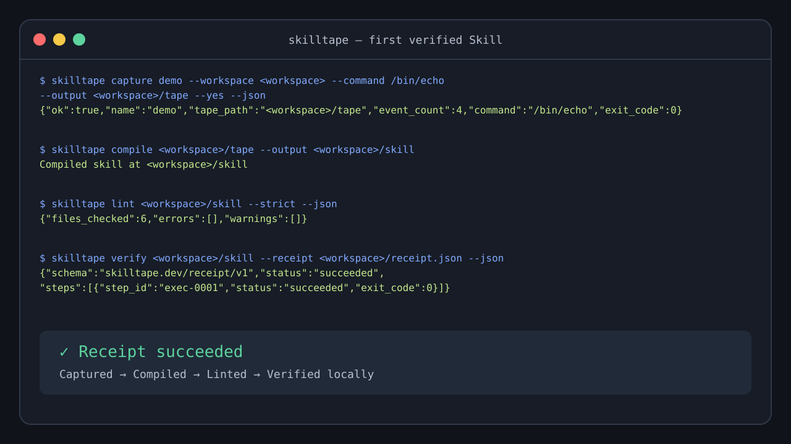

# SkillTape

> **Beta** — Turn a real local workflow into a reviewable Agent Skill you can replay and verify before you share it.

SkillTape captures a command you already run, turns it into a reviewable Skill,
and produces a Receipt that tells you whether the isolated replay succeeded.
It runs locally; the first result needs no account, API key, model provider, or
configuration file.



[Watch the 30-second terminal demo](docs/assets/quickstart-terminal.txt) · [Download v0.1.0](https://github.com/Chumaniac/skilltape/releases/tag/v0.1.0)

## Get a verified Skill in five minutes

Install the fixed public v0.1.0 release without piping a download into a shell.
The installer below is fetched from commit
`beb0bba1870e20e03e5bc80a2d9234c04fc1c6f6`, and the release base URL stays
explicit.

```bash
SKILLTAPE_VERSION="0.1.0"
SKILLTAPE_RELEASE_BASE_URL="https://github.com/Chumaniac/skilltape/releases/download"
installer_path="$(mktemp)"
curl --fail --location --silent --show-error --output "$installer_path" \
  "https://raw.githubusercontent.com/Chumaniac/skilltape/beb0bba1870e20e03e5bc80a2d9234c04fc1c6f6/scripts/install.sh"
chmod +x "$installer_path"
export SKILLTAPE_VERSION SKILLTAPE_RELEASE_BASE_URL
bash "$installer_path"
export PATH="$HOME/.local/bin:$PATH"
skilltape --help
```

Then capture a harmless local command and get a verified result:

```bash
workspace="$(mktemp -d)"

skilltape capture demo --workspace "$workspace" --command /bin/echo --output "$workspace/tape" --yes --json
skilltape compile "$workspace/tape" --output "$workspace/skill"
skilltape lint "$workspace/skill" --strict --json
skilltape verify "$workspace/skill" --receipt "$workspace/receipt.json" --json
```

The final Receipt reports `"status":"succeeded"` when the isolated replay
completed successfully.

## What works today

On Linux, Replay and Verify require `bwrap`/Bubblewrap and an available user
namespace. On macOS, Replay and Verify use the system
`/usr/bin/sandbox-exec`. If that restricted executor is unavailable, Capture,
Compile, Lint, and Export remain usable while Replay and Verify fail closed.
Windows supports Capture, Compile, Lint, and Export; Replay and Verify
intentionally fail closed until an equivalent restricted executor is integrated.

## Use SkillTape when

- You have a local command or workflow worth making repeatable and reviewable.
- You want to inspect the generated Skill before someone else runs it.
- You need a bounded Receipt from an isolated replay before sharing the result.

## It is not yet for

- Replacing a general-purpose agent runtime or model provider.
- Claiming isolated replay on Windows before its restricted executor exists.
- Treating unreviewed Tapes, workflows, or permissions as safe to run.

## Learn more

- [Quickstart](docs/guides/quickstart.md) — the same first verified result with troubleshooting.
- [Installation](docs/guides/installation.md) — platform, update, source-build, and release details.
- [Configuration](docs/guides/configuration.md) — optional release, installation, and Console settings.
- [Minimal Skill example](examples/minimal-skill/README.md) — a small valid package to inspect.
- [Security](SECURITY.md) — sandbox boundaries, redaction, and responsible disclosure.
- [Contributing](CONTRIBUTING.md) — development and contribution guidance.
